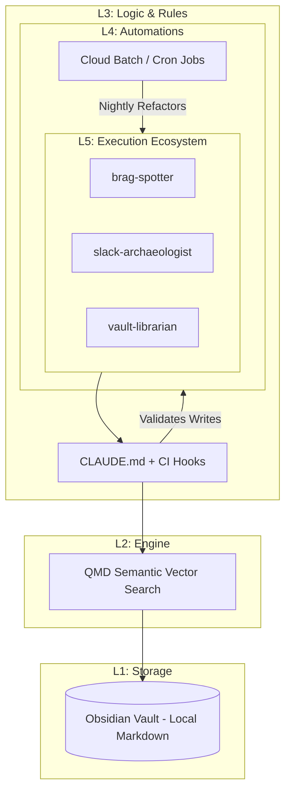

<div align="center">

# 🧠 Obsidian-Jules
**The First Asynchronous, CI/CD-Driven Executive OS for Your Mind**

[](LICENSE)
[](https://obsidian.md)
[]()
[]()
[]()

*Most AI note-taking tools just "read" your text. **Obsidian-Jules** maintains your system, challenges your assumptions, and manages your career in the background while you sleep.*

[Get Started](#-quick-start) • [How it Works](#-the-asynchronous-paradigm) • [Meet the Agents](#-meet-your-autonomous-team) • [Roadmap](#-future-architecture)

</div>

---

## 🛑 The Problem with "Second Brains"

Building a knowledge base is easy. **Keeping it alive is hard.**

Traditional Personal Knowledge Management (PKM) systems inevitably devolve into graveyards of unlinked notes. General AI wrappers just let you "chat" with your notes, but they don't *maintain* the system. You still have to do the heavy lifting of organization, extracting insights from 1-1s, and writing your own performance reviews.

We need more than a chatbot. We need an **Executive OS**.

---

## ⚡ The Asynchronous Paradigm

**Obsidian-Jules** borrows the best paradigms from modern Software Engineering (like Google's Jules agent) and applies them to your personal knowledge base:

| Traditional PKM | Obsidian-Jules OS |
| :--- | :--- |
| **Manual Data Entry** | **Fire & Forget:** Drop raw meeting transcripts into a folder. Background agents process them, extract action items, and link them to the graph automatically. |
| **Silent AI Corruption** | **Knowledge PRs:** Agents *never* overwrite your core files. They create a `Proposed` state (Knowledge Pull Request). You act as the Tech Lead and merge. |
| **Decaying Links** | **Vault CI/CD:** A note without a link is a bug. Lifecycle hooks (`SessionStart`, `PostToolUse`) act as a CI pipeline. If hygiene drops, agents fix it. |
| **Echo Chamber** | **Adversarial Review:** Subagents are explicitly designed to challenge your `Key Decisions` using Socratic dialogue. |

---

## 🏗️ The 5-Layer Architecture

This isn't just a folder of markdown files. It's a living operating system.



---

## 🤖 Meet Your Autonomous Team

Your vault comes pre-configured with specialized subagents living in `.claude/agents/`:

- 🏆 **`brag-spotter`**: Scans your git history, 1:1 notes, and incident reports to automatically draft your performance reviews and brag documents.
- 🕵️ **`slack-archaeologist`**: Triggered by PagerDuty alerts. Automatically compiles reconstruction timelines and drafts incident post-mortems in `work/incidents/drafts/`.
- 📚 **`vault-librarian`**: Runs every Sunday at 2 AM. If your vault's hygiene score drops below 80%, it auto-fixes missing tags and creates a PR for broken links.
- 🎯 **`review-prep`**: Wakes up 14 days before the end of the quarter, analyzes your competency tracking, and generates a draft review brief.

---

## 📂 Folder Structure (The Executive Layout)

Optimized for Senior Engineers, PMs, and Managers:

```text
obsidian-jules/
├── .claude/         # 🧠 The Engine: Agents, Hooks, and CI scripts
├── bases/           # 📊 Database views for your Markdown files
├── brain/           # 🌐 Durable, graph-first knowledge & Key Decisions
├── org/             # 👥 Personal CRM: People, teams, and interactions
├── perf/            # 🚀 Career Management: Brag docs & competencies
├── templates/       # 📄 Standardized markdown templates
└── work/            # 💼 Active tracking: 1-1s, incidents, sprints
```

---

## 🚀 Quick Start

1. **Clone the OS**
   ```bash
   git clone https://github.com/yourusername/obsidian-jules.git my-second-brain
   cd my-second-brain
   ```

2. **Initialize the Agents**
   *(Make sure you have Node.js and an AI CLI like Claude Code or Gemini installed)*
   ```bash
   # The lifecycle hooks will automatically install dependencies on first run
   npm install
   ```

3. **Open in Obsidian**
   Open the `my-second-brain` folder as a new vault in [Obsidian](https://obsidian.md).

---

## 🔮 Future Architecture

We are constantly pushing the boundaries of what an Asynchronous Agentic Second Brain can do:

- **Event-Driven Triggers:** Moving beyond cron jobs to real-time event grids (e.g., triggering `brag-spotter` immediately when a PR is merged).
- **Cross-Vault Federation (Swarm Intelligence):** Enabling team-wide sharing where your local agent negotiates with coworkers' agents to merge conflicting architectural notes—without exposing private DMs.
- **Continuous Background Synthesis:** Agents actively traverse the graph in the background to find "missing link" insights between siloed projects and present them as morning briefings.
- **Richer Multi-Modal Integration:** Processing calendar events, Zoom transcripts, and Jira webhooks asynchronously.
- **Self-Healing Indexing:** Graph databases (like Neo4j) backing the semantic search to automatically refactor the taxonomy based on usage patterns.

---

<div align="center">
  <b>Built for those who want their tools to work for them, not the other way around.</b><br>
  ⭐️ If you find this project useful, please consider giving it a star!
</div>
