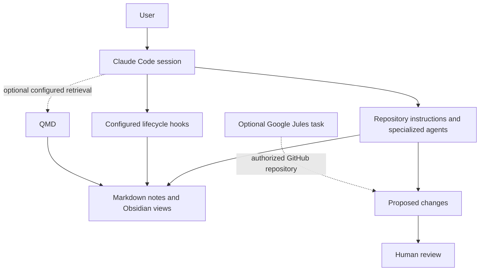

# Obsidian-Jules

**Reviewable AI-assisted maintenance for an Obsidian knowledge base.**

[](LICENSE)
[](https://github.com/sjfakharian/obsidian-jules/actions/workflows/ci.yml)
[](docs/PROJECT_STATUS.md)

Keep knowledge in Markdown. Use specialized Claude Code agents and lifecycle hooks to organize notes, inspect links, and prepare proposed changes. Review the result before treating it as trusted knowledge.

[Quick start](docs/QUICKSTART.md) · [Implementation status](docs/PROJECT_STATUS.md) · [Contributing](CONTRIBUTING.md) · [Security](SECURITY.md)

> **Early-stage scaffold, not an unattended service.** Agent definitions and hook scripts are included. Scheduled cloud jobs, external connectors, and a universal approval gate are not installed merely by cloning this repository. See the implementation status before relying on a workflow.

## What problem does it address?

A useful knowledge base needs maintenance: broken links need attention, meeting notes need context, and review drafts need evidence. Obsidian-Jules explores applying software-engineering habits to that work: small changes, source links, validation, and human review.

The central workflow is:

**Capture → inspect → propose → review → accept.**

A "Knowledge PR" is a reviewable proposal or Git branch/pull request for a knowledge change. It is a workflow convention here, not proof that every possible write is technically prevented. Local agents have file-editing tools; keep backups and review permissions.

## What is included?

| Component | Repository evidence | Boundary |
| --- | --- | --- |
| Specialized agent definitions | [`.claude/agents/`](.claude/agents) | Prompts and tool policies; execution depends on the chosen runner. |
| Reusable workflows | [`.claude/commands/`](.claude/commands) | Commands for capture, audits, review preparation, and related tasks. |
| Claude Code hook configuration | [`.claude/settings.json`](.claude/settings.json) | Runs on matching Claude Code events, not on every edit made directly in Obsidian. |
| TypeScript hook and helper code | [`.claude/scripts/`](.claude/scripts) | Includes validation, context, memory, and MCP-related helpers. |
| Test sources and CI configuration | [Tests](.claude/scripts/tests) and [CI](.github/workflows/ci.yml) | See actual workflow results; their presence alone does not establish a passing suite. |
| Note templates and Base views | [`templates/`](templates) and [`bases/`](bases) | Adapt their referenced paths and schemas to your own private vault. |
| Optional semantic-search integration | [QMD adapter](.claude/scripts/qmd-mcp.mjs) | Requires a separately configured QMD installation and index. |

Examples include `vault-librarian` for audits, `brag-spotter` for finding evidence of accomplishments, `review-prep` for review preparation, and `correction-sweep` for locating repeated claims. Read each definition before granting access to your files or accounts.

## How the pieces fit



Claude Code is the local execution path. Google Jules is an optional external task runner; it is not installed, authenticated, or scheduled by this project. The two products have separate accounts, permissions, and usage terms. Neither integration implies endorsement by Anthropic, Google, or Obsidian.

## Start with a disposable copy

Use Git, Obsidian, and a recent Node.js release supporting TypeScript type stripping; Node.js 22.18+ is a conservative starting point for the bundled hook commands. Install and authenticate Claude Code using its [official instructions](https://code.claude.com/docs/en/overview).

```sh
git clone https://github.com/sjfakharian/obsidian-jules.git obsidian-jules-sandbox
cd obsidian-jules-sandbox
node --version
```

Read [AGENTS.md](AGENTS.md), [CLAUDE.md](CLAUDE.md), and [the hook configuration](.claude/settings.json) before starting an agent. Open the folder as a vault in Obsidian and begin with synthetic notes, not private meeting transcripts.

The npm package is under `.claude/scripts`, **not at the repository root**. To install its declared development dependency and invoke its existing tests:

```sh
npm --prefix .claude/scripts install
npm --prefix .claude/scripts test
```

These are the package's test commands, not a claim that a complete clean-machine run has been verified for your environment. Type checking has separate development-tool prerequisites described in the [quick start](docs/QUICKSTART.md).

Then start a Claude Code session from the vault root:

```sh
claude
```

For a cautious first session, ask it to inspect the structure and suggest an audit plan without modifying files. Review the plan and any subsequent diff before accepting edits. Authentication may use an eligible Claude subscription or a supported API configuration; an API key is not the only sign-in option.

## What is experimental?

Scheduled Sunday audits, PagerDuty-triggered incident work, quarter-end review jobs, and unattended Knowledge PR generation appear as ideas or instructions in agent files. They require an actual scheduler, integration code, and credentials before they can operate. A schedule written in Markdown does not install a job.

The bundled `CLAUDE.md` and manifest also contain deployment-specific references not all present in this public export. This is not yet a one-command, fully populated personal vault. [The status document](docs/PROJECT_STATUS.md) records the boundary and the next engineering work.

## Privacy and safe operation

Local Markdown storage does **not** make cloud inference local. Claude Code, Jules, and configured connectors may transmit selected content to their providers. Review their permissions and terms before using sensitive material.

Some helpers can write notes, indexes, or session backups. Inspect the scripts, keep a recoverable Git history or separate backup, and use a private repository for a real personal vault. Never publish API keys, work transcripts, personnel records, or generated session logs in this public project. A `.gitignore` is a precaution, not a security boundary or a way to erase previously committed files.

## Contributing

Focused contributions are welcome: reproducible hook tests, safe-write behavior, portable setup, documentation, and explicit separation between implemented code and proposed automation. See [CONTRIBUTING.md](CONTRIBUTING.md) and [the maintainer checklist](docs/MAINTAINER_CHECKLIST.md).

## Acknowledgments and license

This project includes code and conventions adapted from [Obsidian Mind](https://github.com/breferrari/obsidian-mind), including the vault hook/helper foundation. Bundled Obsidian skills are sourced from [kepano/obsidian-skills](https://github.com/kepano/obsidian-skills), as identified by the skill updater. These are upstream contributions, not original work claimed by this repository.

Project modifications are MIT-licensed. Retain the [project license](LICENSE), the upstream notices in [THIRD_PARTY_NOTICES.md](THIRD_PARTY_NOTICES.md), and any component-specific licenses. The notices document confirmed sources; a complete vendored-component provenance audit remains maintenance work.
